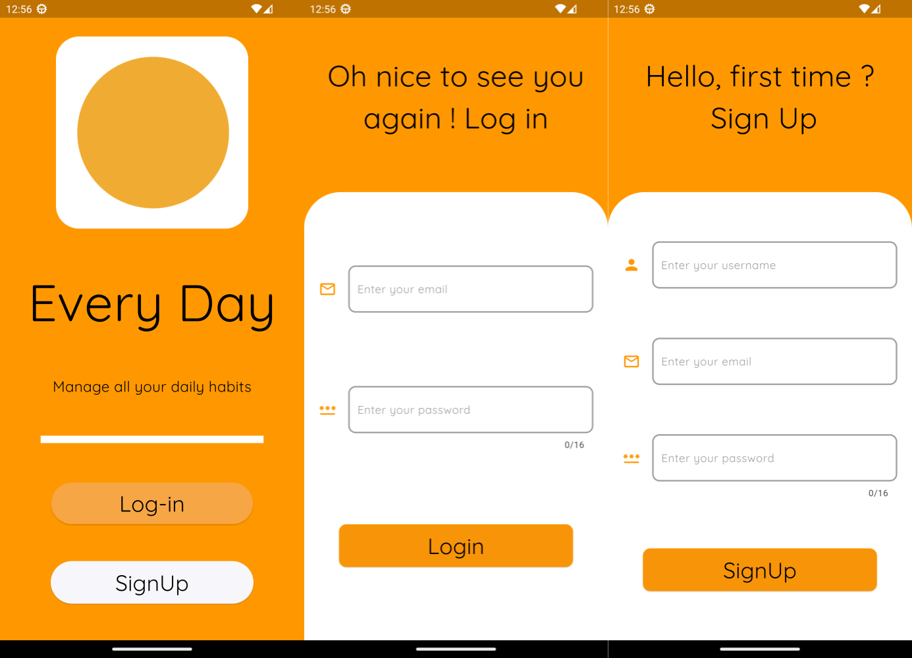
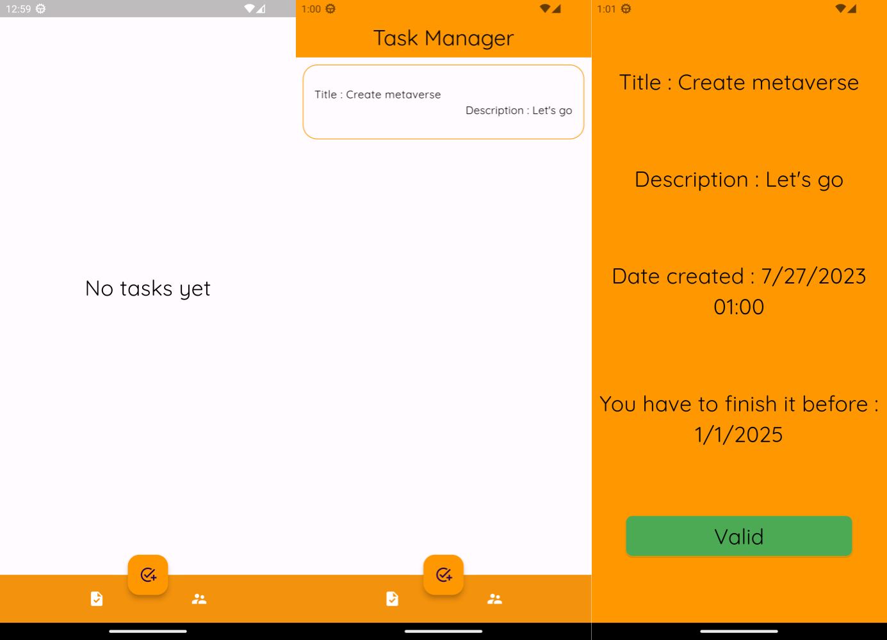
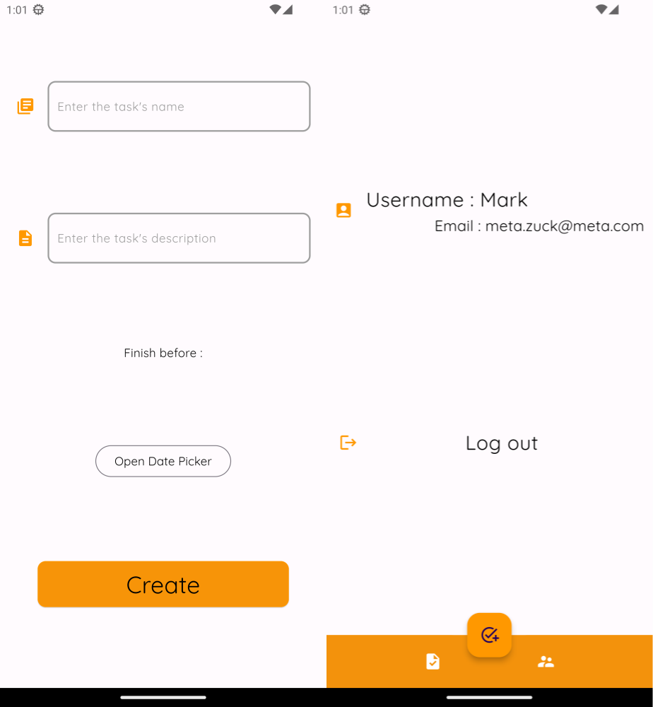

<h1 align="center">📑 | Every-day</h1>

### Every day is a little todo list made with firebase and dart/flutter
### I try to improve myself so I listen to all criticism, advice

<h1 align="center">📒 | Features</h1>

### ➔ Firebase connection 
### ➔ Pushed notifications
### ➔ Possibility to impose a deadline to do your tasks

<h1 align="center">🔗 | Links</h1>

### [My personal server discord](https://discord.gg/H3Aj3x2caw)
### [Firebase](https://console.firebase.google.com/)

# ⭐ | Leave a star :)

<h1 align="center">📱 | App render</h1>

